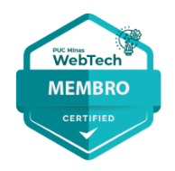
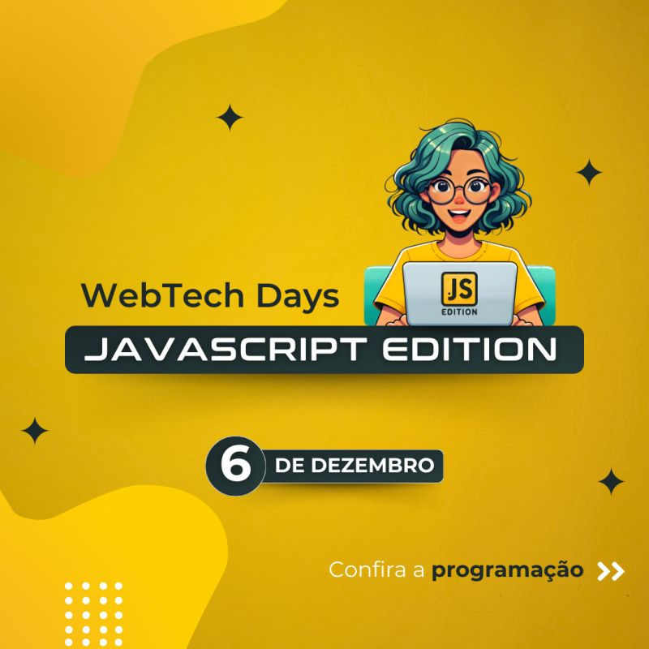

Olá pessoal, esté é um grupo de alunos dos cursos de Tecnologia da Informação da [PUC Minas](https://pucminas.br). Nosso objetivo é gerar espaço de trabalho para que alunos e professores criem juntos aplicações, ferramentas e conteúdo para interessados em criar soluções e produtos digitais.

Várias contribuições têm origem também nos trabalhos de alunos e professores dos cursos de [pós-graduação da PUC Minas em Tecnologias Digitais](https://icei.pucminas.br/latosensu).

## Participe do WebTech   ⭐️ ⭐ ⭐ ⭐ ⭐

Conheça nossos ambientes e as nossas ações, [clique aqui](https://linktr.ee/webtech.pucminas). Entre em contato conosco e venha  conhecer nosso Lab para interagir com os membros e mentores. Há muita coisa para fazer juntos. Venha com a gente. 

⚠️  O **processo de seleção de membros para o semestre 2024/1** está encerrado. Acompanhe a gente que todo semestre vamos recrutar novos participantes.

Nossos canais: [LinkedIn](https://www.linkedin.com/company/webtech-puc-minas) | [YouTube](https://www.youtube.com/@webtech.pucminas) | [Instagram](https://www.instagram.com/webtech.pucminas)

  

## WebTech Days

 - **WebTech Days - JavaScript Edition**  
    * Local: PUC Minas Praça da Liberdade - Auditório Liberdade
    * Data/horário: 06/12/2027
    * Programação 
      * [Abertura do Evento – WebTech](https://www.youtube.com/watch?v=lp9UIeI6tig)
        - Catarina Castro, Gabriel Silva e Pedro Braga (WebTech - PUC Minas)
      * [Boas práticas com JavaScript](https://www.youtube.com/watch?v=aOhozjcKs2I)
        - João Lima
      * [await, async não é sync. I promise.](https://www.youtube.com/watch?v=bMi6UUm_o7A&t=12s)
        - Rommel Carneiro (WebTech PUC Minas)
      * [Frameworks Front End mais populares](https://www.youtube.com/watch?v=cv60ZmV7E4Y)
        - Samuel Silva ()
      * [Mesa redonda - Tendências no mundo JS](https://www.youtube.com/watch?v=9bpqDaOI9q0)
        - Lucas Porto - Mediador
        - Luis Baldi
        - PrimoDev
        - Samuel Silva
 
  

## WebTech Labs

- [Git e Gitflow](https://github.com/WebTech-PUC-Minas/git-gitflow)
  Orientações sobre o uso do git e o GitFlow, ferramentas fundamentais para o desenvolvimento colaborativo, ajudando a manter o código organizado e permitindo o trabalho em equipe de maneira eficaz.
- [API RESTful com Node.js + BD + Segurança + Docker](https://github.com/WebTech-PUC-Minas/lab-node-basic-api)
  Roteiro para montagem de uma API RESTful na plataforma Node.JS, com operações de CRUD (Create, Read, Update e Delete) e segurança integrada baseada no uso de tokens JWT (JSON Web Token) como formato de identificação, além do uso da biblioteca Knex como QueryBuilder integrando banco de Dados PostgreSQL.
- [API RESTful com SpringBoot + BD + Segurança + Docker](https://github.com/WebTech-PUC-Minas/lab-springboot-basic-api)
  Roteiro para o desenvolvimento de APIs RESTful em projetos Spring Boot utilizando Docker para facilitar a criação de contêineres e isolamento de serviços, além de gerenciamento de banco de dados PostgreSQL com o uso do Flyway para migrações de banco de dados.
- [Plataforma ELK --&gt; Elastic Seach + Logstash + Kibana](https://github.com/WebTech-PUC-Minas/lab-elk-db)
  Ambiente de busca com [*Elastic Search*](https://www.elastic.co/) indexando de forma automatizada conteúdo disponível em banco de dados Postgres, além de orientações sobre as diversas formas de consulta à API do *Elastic Search*.
- [Automação Web e Webscrape com Puppeteer](https://github.com/WebTech-PUC-Minas/lab-puppeteer) Puppeteer é um mecanismo que simula o navegador Web de forma programática para automatizar açoes na Web, contemplando testes de software e raspagem de dados (WebScrape).
- [Plataforma API Gateway com Kong](https://github.com/WebTech-PUC-Minas/lab-api-gateway-kong)
  Configuração de ambiente para a implementação de um API Gateway com base no [Kong Gateway](https://konghq.com/products/kong-gateway), tendo o PostgreSQL como base de dados e o Konga como dashboard de administração.
- [Documentação de APIs REST com OpenAPI Specification](https://github.com/WebTech-PUC-Minas/lab-openapi)
  Apresentação de detalhes do OpenAPI Specification, o padrão de documentação de APIs RESTful.

## WebTech'ers (Membros)

Alunos
- Catarina F. M. Castro - [catfmcastro](https://github.com/catfmcastro)
- Gabriel Henrique Silva Pereira - [gab-hsp](https://github.com/Gab-HSP)
- Guilherme Leroy - [ggleroy](https://github.com/ggleroy)
- Henrique Silverio Nahim - [hsnahim2005](https://github.com/hsnahim2005)
- Jhonata Silveira Dias - [jhonatasdias](https://github.com/jhonatasdias)
- Julia Gabriela de Resende - [ju-rsende](https://github.com/ju-rsende)
- Julia Carvalho Carneiro - [jubju](https://github.com/jubju)
- Jully Ketely - [jullysilva](https://github.com/jullysilva)
- Kimberly Liz Spencer Lourenço - [kspencerl](https://github.com/kspencerl)
- Luca Azalim - [lucaazalim](https://github.com/lucaazalim)
- Pedro Henrique Braga - [bragap](https://github.com/bragap)
- Rafael Moreira - [rafamtf](https://github.com/RafaMtf)
- Talisson Augusto - [nisuk3](https://github.com/nisuk3)

Mentores | Professores
- Ana Coimbra - [anacoimbrag](https://github.com/anacoimbrag)
- Lucas Porto - [portolucas](https://github.com/portolucas)
- Ilo Rivero - [ilorivero](https://github.com/ilorivero)
- Rommel Carneiro (**Idealizador do projeto**) - [rommelcarneiro](https://github.com/rommelcarneiro)
